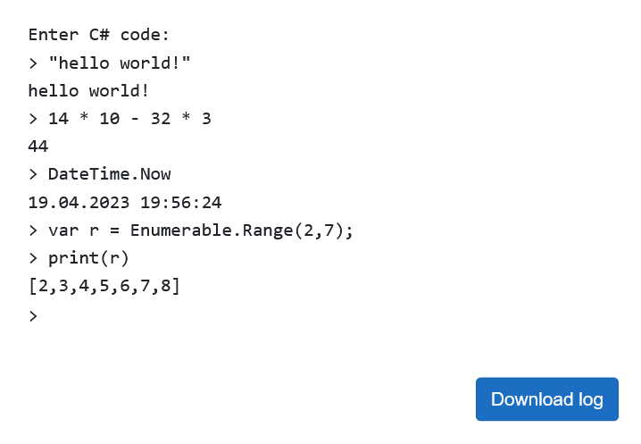

# ShaREPL
A Blazor Server app for sharing C# [REPL](https://en.wikipedia.org/wiki/Read%E2%80%93eval%E2%80%93print_loop) environments across the web.

## Setup

By default, the app uses SQL Server LocalDB (which comes bundled with Visual Studio) for data storage - 
it can be replaced with any other SQL Server instance by changing the connection string in `Program.cs`.

Before running the app it is necessary to apply the database migrations - use the `UpdateDatabase` commmand
in Visual Studio's **Package Manager Console** window or perform the equivalent `dotnet ef database update`
in the CLI (which requires the `dotnet-ef` tool to be installed).

Launch the app through Visual Studio or via `dotnet run` and open the link presented by the server process.

## Features

Use the **Launch** button to open a new REPL session. Each session is identified by a GUID in the last 
segment of the URL, which allows multiple users to join and use the same execution environment with full cross-
synchronization - just share the address. The input & output of a session is persisted in the database, which 
prevents the users from loosing their data should they accidentally leave the app; unfortunately, the execution 
state is not automatically restored, so the user may need to copy-paste their code.

The app offers an interactive C# environment with some of the most popular namespaces available to the user:

- System,
- System.Math,
- System.Collections.Generic,
- System.Linq,
- System.Text,
- System.Text.Json,

as well as a predefined `print()` function. The **arrow up** key can be used to put the last inputted line into 
the input field, allowing for quick corrections. A session archive can be downloaded with the **Download log** button.

There is no mechanism in place to moderate access to the sesssions - anyone can join if they happen to 
know the session GUID.
